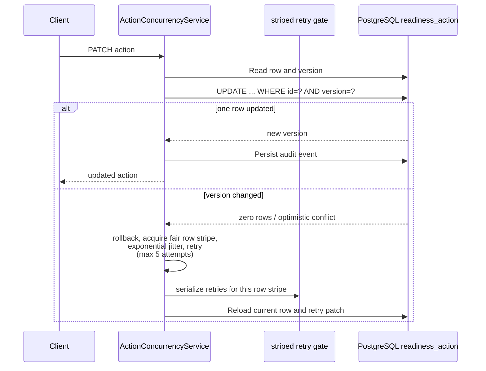

# Readiness action optimistic-lock retry

```mermaid
sequenceDiagram
    participant Client
    participant Update as ActionConcurrencyService
    participant Gate as striped retry gate
    participant DB as PostgreSQL readiness_action
    Client->>Update: PATCH action
    Update->>DB: Read row and version
    Update->>DB: UPDATE ... WHERE id=? AND version=?
    alt one row updated
        DB-->>Update: new version
        Update->>DB: Persist audit event
        Update-->>Client: updated action
    else version changed
        DB-->>Update: zero rows / optimistic conflict
        Update->>Update: rollback, acquire fair row stripe,<br/>exponential jitter, retry<br/>(max 5 attempts)
        Update->>Gate: serialize retries for this row stripe
        Update->>DB: Reload current row and retry patch
    end
```

The retry reapplies the caller's patch to a fresh managed row, so disjoint concurrent updates are not silently overwritten by a stale detached entity.
